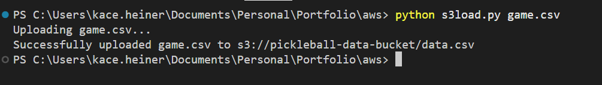
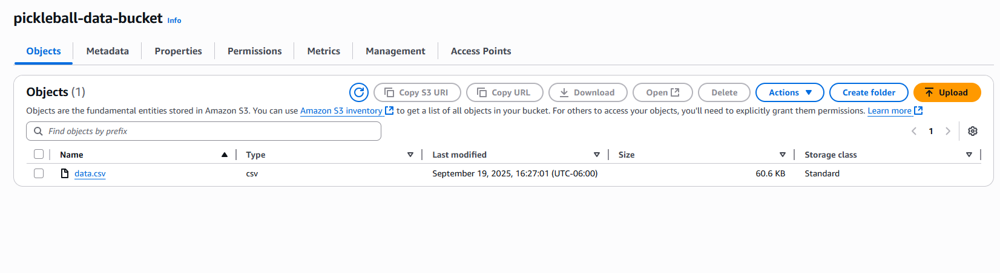
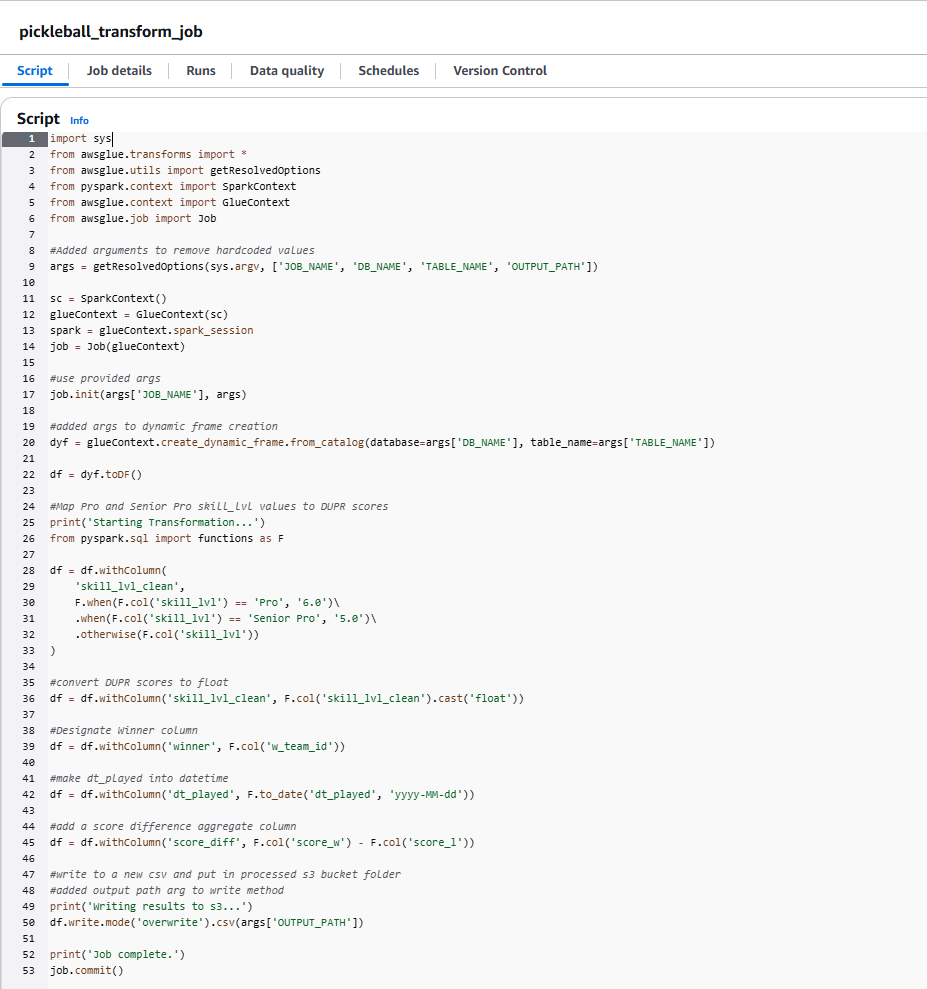
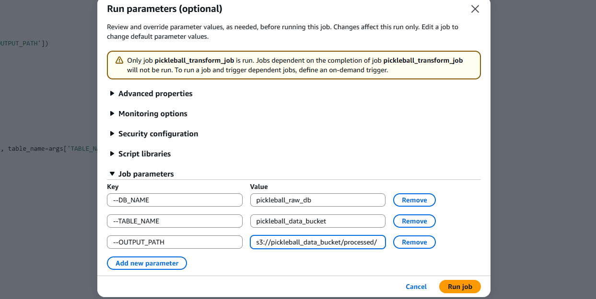

# AWS Data Pipeline Project – Pickleball Analytics

Hi, thanks for viewing this project!

This is a portfolio project where I practiced AWS pipeline development using a pickleball games dataset.  
The goal was to build a modern data pipeline that ingests raw data, transforms it, and makes it available for analytics. 
---
## Project Overview

Raw CSV data is brought into S3 using Python boto3. After creating a crawler in AWS, I recreated a python program to create and run the crawler
to crawl the s3 bucket with the raw csv and then output into a Glue Data Catalog. 

I explored the catalog database using an AWS notebook and converted that notebook into a PySpark Script to transform the csv data and output it back into a processed s3 bucket.

I loaded the processed s3 file into Snowflake after created a warehouse and table to house the data, and then wrote some exploratory and analytics queries in SQL. 

---

## Pipeline Overview

This AWS data pipeline:
1. Ingests raw CSV files into Amazon S3
2. Catalogs them with AWS Glue Crawler
3. Transforms data using PySpark in a Glue ETL Job
4. Loads the processed data into Snowflake for analytics

---

## Architecture Diagram


---

## Tech Stack

- AWS S3 – Raw & processed data storage  
- AWS Glue – Data Catalog + PySpark ETL  
- Python – boto3, argparse for automation  
- Snowflake – Cloud data warehouse for analytics  

---

## Screenshots
### S3 Upload Through Python boto3



### PySpark ETL Job Script
```py
import sys
from awsglue.transforms import *
from awsglue.utils import getResolvedOptions
from pyspark.context import SparkContext
from awsglue.context import GlueContext
from awsglue.job import Job

#Added arguments to remove hardcoded values
args = getResolvedOptions(sys.argv, ['JOB_NAME', 'DB_NAME', 'TABLE_NAME', 'OUTPUT_PATH'])
  
sc = SparkContext()
glueContext = GlueContext(sc)
spark = glueContext.spark_session
job = Job(glueContext)

#use provided args
job.init(args['JOB_NAME'], args)

#added args to dynamic frame creation
dyf = glueContext.create_dynamic_frame.from_catalog(database=args['DB_NAME'], table_name=args['TABLE_NAME'])

df = dyf.toDF()

#Map Pro and Senior Pro skill_lvl values to DUPR scores
print('Starting Transformation...')
from pyspark.sql import functions as F

df = df.withColumn(
    'skill_lvl_clean',
    F.when(F.col('skill_lvl') == 'Pro', '6.0')\
    .when(F.col('skill_lvl') == 'Senior Pro', '5.0')\
    .otherwise(F.col('skill_lvl'))
)

#convert DUPR scores to float
df = df.withColumn('skill_lvl_clean', F.col('skill_lvl_clean').cast('float'))

#Designate Winner column
df = df.withColumn('winner', F.col('w_team_id'))

#make dt_played into datetime
df = df.withColumn('dt_played', F.to_date('dt_played', 'yyyy-MM-dd'))

#add a score difference aggregate column
df = df.withColumn('score_diff', F.col('score_w') - F.col('score_l'))

#write to a new csv and put in processed s3 bucket folder
#added output path arg to write method
print('Writing results to s3...')
df.write.mode('overwrite').csv(args['OUTPUT_PATH'])

print('Job complete.')
job.commit()
```


### Running ETL job with Parameters


---

## Results

Here’s an example analytics query in Snowflake:
View the Snowflake folder for all queries and connection scripts.

```sql
--Split matches by team and show game history for each team
create temporary table win_loss_by_date as
with split_games as (
    select game_id, match_id, dt_played, score_diff, winner, w_team_id as team_id
    from games_data
    union all
    select game_id, match_id, dt_played, score_diff, winner, l_team_id as team_id
    from games_data
)
select
    team_id,
    dt_played,
    score_diff,
    case 
        when team_id = winner then 'win'
        else 'loss'
    end as match_outcome,
    row_number() over (partition by team_id order by dt_played) as game_history
from split_games
order by team_id, game_history;
```
