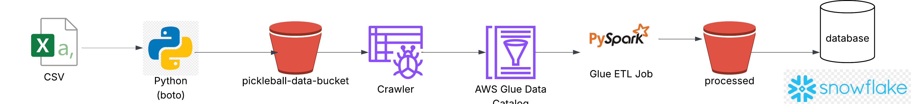

# AWS Data Pipeline Project – Pickleball Analytics

Hi, thanks for viewing this project!

This is a portfolio project where I practiced AWS pipeline development using a pickleball games dataset.  
The goal was to build a modern data pipeline that ingests raw data, transforms it, and makes it available for analytics. 

---

## Pipeline Overview

This AWS data pipeline:
1. Ingests raw CSV files into Amazon S3
2. Catalogs them with AWS Glue Crawler
3. Transforms data using PySpark in a Glue ETL Job
4. Loads the processed data into Snowflake for analytics

---

## Architecture Diagram



---

## Tech Stack

- AWS S3 – Raw & processed data storage  
- AWS Glue – Data Catalog + PySpark ETL  
- Python – boto3, argparse for automation  
- Snowflake – Cloud data warehouse for analytics  

---

## Screenshots
![S3 Upload through Python boto3]
(screenshots/boto3_upload.png)
(screenshots/aws_bucket_with_csv_upload.png)
(Insert screenshots here — S3 bucket, Glue crawler, Glue job, Snowflake queries)

---

## Results

Here’s an example analytics query in Snowflake:

```sql
SELECT skill_lvl, COUNT(*) AS games_played
FROM pickleball_games
GROUP BY skill_lvl
ORDER BY games_played DESC;

